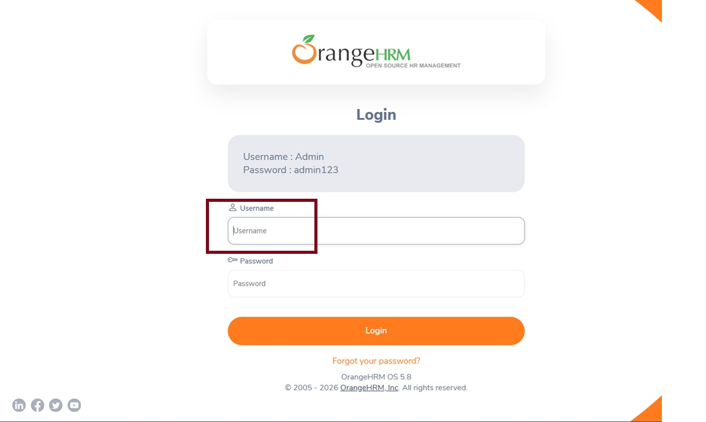
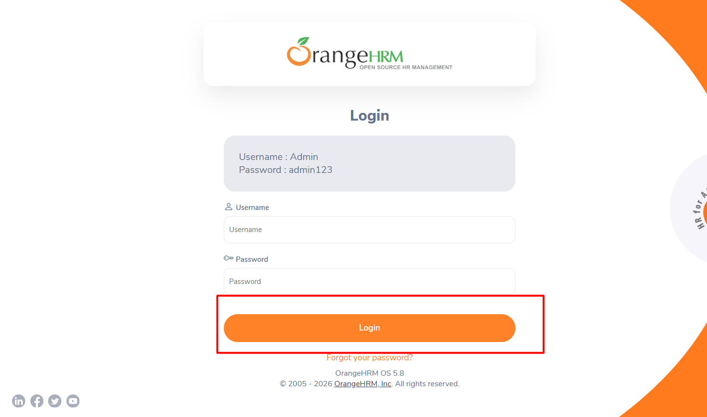

# 🐛 Registro de Bugs Encontrados

| ID | Título do Bug | Severidade | Status |
| :--- | :--- | :--- | :--- |
| BUG-001 | Foco do teclado não visível no botão 'Login' | Média | Aberto |

---

### [BUG-001] Foco do teclado não visível no botão 'Login'

**Descrição:** Ao navegar pela tela de login utilizando a tecla `TAB`, o indicador visual de foco (borda azul/laranja) desaparece ao chegar no botão "Login", dificultando a identificação para usuários que dependem exclusivamente do teclado.

**Ambiente:** - **URL:** https://opensource-demo.orangehrmlive.com/
- **Navegador:** Google Chrome Versão 121.0.6167.140
- **Resolução:** 1920x1080

**Passos para Reprodução:** 1. Acessar a página de Login.  
2. Pressionar a tecla `TAB` até passar pelo campo "Password".  
3. Pressionar `TAB` mais uma vez para chegar ao botão "Login".  

**Resultado Esperado:** O botão "Login" deve apresentar um destaque visual claro quando receber o foco do teclado.

**Resultado Atual:** O foco é movido para o botão (o sistema reconhece o comando), mas não há nenhuma alteração visual na interface.

**Evidência:** 
